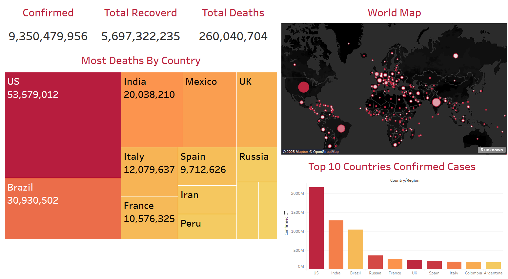

# 🌍 COVID-19 Global Data Dashboard & Storytelling Project

This project visualizes and narrates the impact of COVID-19 across the globe using a clean and interactive dashboard built with **Tableau Public** and **Python (for preprocessing)**.

The project focuses on key metrics:
- Confirmed Cases
- Total Recoveries
- Total Deaths

It highlights top countries affected and presents a story-driven analysis of the pandemic’s spread.

---

## 📊 Dataset Overview

The dataset used contains the following columns:
- `ObservationDate` – Date of observation  
- `Country/Region` – Country name  
- `Confirmed` – Total confirmed COVID-19 cases  
- `Deaths` – Total deaths  
- `Recovered` – Total recoveries  

---

## 🌟 Key Insights

- The **United States** leads in both confirmed cases and deaths.
- **India** and **Brazil** also show significant impact in all three metrics.
- World map visualization reveals dense clustering in North America, Europe, and parts of Asia.
- Global numbers reached over **9 Billion** confirmed cases and **260 Million** deaths (Note: artificial dataset for educational purposes).

---

## 📷 Dashboard Preview

Here’s a snapshot of the dashboard created in Tableau Public:

---

## 📚 Tableau Story Link

👉 View the interactive **Tableau Story Dashboard** here:  
**[https://public.tableau.com/app/profile/ziad.masoud7530/viz/COVID-19_17445893597840/COVID-19_Analysis](#)**  

---

## 📌 Notes

- This project is intended for educational purposes only.
- The dataset may not reflect real or current values.

